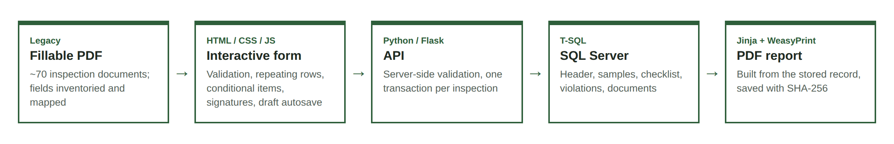
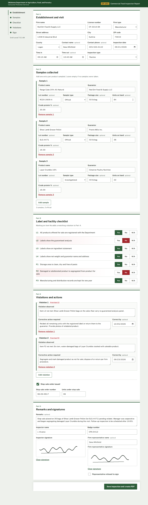
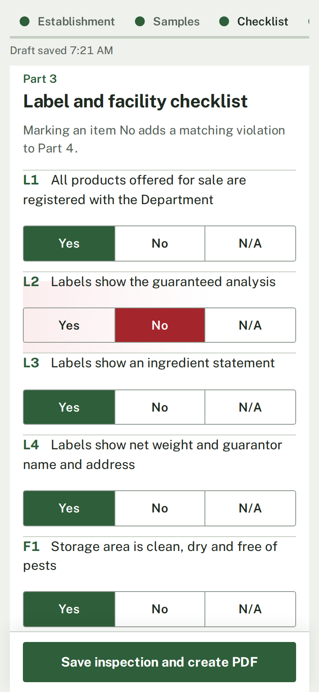
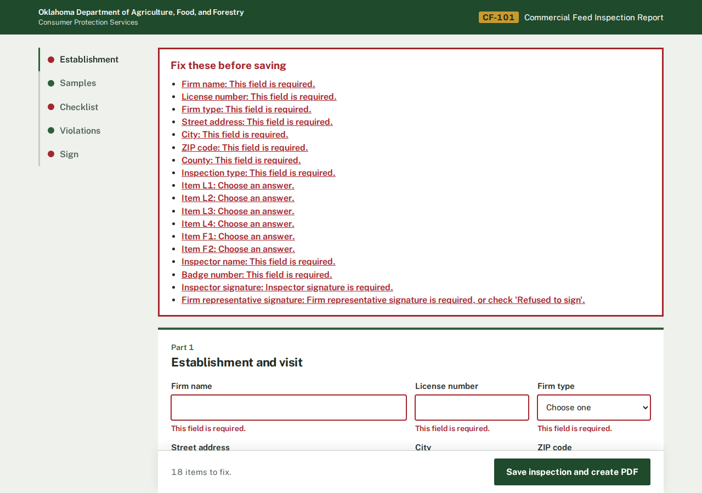

# Inspection forms: fillable PDF → HTML form → SQL → PDF

A small reference project for digitizing paper inspection workflows. A
fillable PDF inspection document is rebuilt as an interactive HTML form,
the inspector's entries are saved to a SQL database, and a Jinja template
compiles the stored record back into a PDF report.

The sample form included here, **CF-101 Commercial Feed Inspection Report**,
is fictional. It was written to exercise the parts that make these forms
awkward: repeating rows, conditional questions, cross-field rules and
signatures.



| Desktop | Phone | Validation |
|---|---|---|
|  |  |  |

Sample output: [`sample_output/CF-2026-000001.pdf`](sample_output/CF-2026-000001.pdf)

## What it does

1. **HTML form** (`templates/feed_inspection_form.html`) follows the paper
   form's Parts 1-5 and is sized for tablets: 16px text, 44px touch targets,
   usable on a phone.
2. **JavaScript** (`static/js/`) handles repeating rows for samples and
   violations, conditional checklist items, finger and stylus signature pads,
   inline validation with an error summary, and draft autosave so a dropped
   connection in the field does not lose work. Marking a checklist item **No**
   adds a matching violation automatically.
3. **API** (`app.py`, Flask) re-validates everything on the server
   (`validation.py`) and saves the header, samples, checklist and violations
   in **one transaction** (`db.py`).
4. **SQL** (`sql/schema.mssql.sql`) is T-SQL for SQL Server: identity keys,
   foreign keys with cascade, CHECK constraints (including `ISJSON` on the raw
   payload), indexes for common lookups, and a summary view. A SQLite mirror
   lets the project run with no setup.
5. **PDF** (`pdf.py`, `templates/pdf/`) renders the *stored* record through a
   Jinja template and WeasyPrint, then saves the PDF bytes and a SHA-256 hash
   to `InspectionDocuments`.

## Run it

```bash
pip install -r requirements.txt
python app.py                       # http://localhost:5000  (SQLite, zero setup)
python -m pytest -q                 # 8 tests: happy path plus every business rule
python scripts/generate_sample.py   # writes sample_output/CF-2026-000001.pdf
```

On macOS, WeasyPrint needs Pango from Homebrew:

```bash
brew install pango
export DYLD_FALLBACK_LIBRARY_PATH=$(brew --prefix)/lib:$DYLD_FALLBACK_LIBRARY_PATH
```

If port 5000 is taken by AirPlay Receiver, use `flask --app app run --port 5001`.

Against SQL Server:

```bash
docker compose up --build
docker compose exec db /opt/mssql-tools18/bin/sqlcmd -S localhost -U sa -P "YourStrong!Passw0rd" -C -i /schema/schema.mssql.sql
```

`DB_DIALECT=mssql` switches `db.py` to pyodbc. The queries are the same
parameterized SQL, with `OUTPUT INSERTED` and `TOP` in place of SQLite's
`RETURNING` and `LIMIT`.

## Built for many forms, not one

The expensive part of a conversion project is repetition, so the code splits
into what every form shares and what each form owns:

| Shared (written once) | Per form (small) |
|---|---|
| `static/js/form-core.js`: repeaters, conditionals, signatures, validation, drafts | `forms/<form>.py`: fields, options, checklist items, show-when rules |
| `templates/pdf/_report_base.html`: masthead, fonts, page numbers, footer | `templates/<form>_form.html` |
| `db.py` transaction and insert helpers, `InspectionDocuments` | `static/js/<form>.js`: that form's business rules |
| `pdf.py` render and store pipeline | `templates/pdf/<form>.html` (extends the base) |

`docs/field-mapping.md` shows the per-form checklist: inventory the PDF's
fields, map each one to an input and a column, confirm the rules with the
form's owner, build, then verify against the original.

## Project layout

```
app.py                     Flask routes
validation.py              server-side rules, errors keyed by field path
db.py                      SQL Server / SQLite data access, one transaction per save
pdf.py                     Jinja + WeasyPrint, stores PDF and SHA-256
forms/feed_inspection.py   form definition shared by HTML, validation and PDF
templates/                 HTML form and PDF templates
static/                    CSS, JS, Public Sans font
sql/                       T-SQL schema plus SQLite mirror for local runs
tests/                     pytest suite
docs/                      field mapping, screenshots
Dockerfile, docker-compose.yml
```

## Notes

The sample form and its generated PDF are illustrations. The PDF is marked as
a demonstration document and is not an official record of any organization.